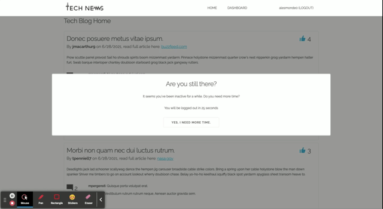
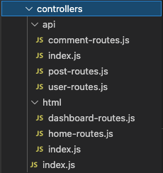

# 14 An MVC Online Blog
[](https://www.gnu.org/licenses/gpl-3.0)

## Description
This is a an Tech News app. On the homepage, pre-login, the general public can see the posts published by registered members. Registered members can create, retrieve, update and delete posts. All registered members can comment on each others' posts and they can also like a post.

Check it out here: https://thetechnews.herokuapp.com/

## Table of Contents
* [Installation](#Installation)
* [Usage](#Usage)
* [Code](#Code)
* [Questions](#Questions)

## Installation
This app is deployed in Heroku: https://thetechnews.herokuapp.com/ - If you want to run this app locally, you'll need the following NPM packages:

* express
* express-handlebars
* express-session
* dotenv
* sequelizer
* connect-session-sequelizer
* bcrypt

Additionally, you'll need to create the datbase described on db/schema.sql and seed it by running node seeds in the command line.
```
node seeds
```

## Usage
Check the app live here: https://thetechnews.herokuapp.com/

### Viewing posts
By default, the app will list all posts available. General public can interact with the home page to scroll through the posts and see them in a one-by-one setting. However, in order to comment and like posts, users must register.


### Register
The app has a signup functionality to register users. Once you've registerd, it will return you back to the login page. At that point you may use your newly created credentials. 


### Login
Login in is pretty stadard - enter credentials, log in. Enter wrong credentials, stay where you are. Yes, future state I'll add a user message, for now, the focus is on MVC, not front end.

After logging in, users land on the dashboard.


### Le C.R.U.D. ité
Once logged in, users may Create, Retrieve, Update, and Delete posts from their dashboard.


### Liking and commenting
I've implemented a somewhat Facebook-ish Like feature. Registered users can click on the thumbs up on any post. Whether it is on their dashboard, or on the homepage. 

It works as a toggle: click it once, you liked the post, clicked it again, and your like is gone.

Ah yes, and you can comment too...


### Session
The app has a handler for session inactivity. If any logged user spends more than 3 minutes idle (that is: no mouse move, no key press), a message will be displayed to alert user of imminent logout.

If no action is taken after the message, the app will logout in 60 seconds.



## Code

### Models
#### User
| Column | Data Type | PK | NN | Notes         |
|--------|-----------|----|----|---------------|
| id     | INTEGER   | Y  | Y  | Auto increment|
| username | VARCHAR(255)   |    | Y  | |
| password | VARCHAR(255)   |    | Y  | |
| email | VARCHAR(255) |    | Y  | |
| created_at | DATETIME | | Y  | |
| updated_at | DATETIME | | Y  | |
#### Post
| Column | Data Type | PK | NN | Notes         |
|--------|-----------|----|----|---------------|
| id     | INTEGER   | Y  | Y  | Auto increment|
| title | VARCHAR(255)   |    | Y  | |
| post_url | VARCHAR(255)   |    |  | |
| post_text | TEXT |    | Y  | |
| user_id     | INTEGER   |  | Y  | Foreign key (User)|
| created_at | DATETIME | | Y  | |
| updated_at | DATETIME | | Y  | |
#### Comment
| Column | Data Type | PK | NN | Notes         |
|--------|-----------|----|----|---------------|
| id     | INTEGER   | Y  | Y  | Auto increment|
| post_id| INTEGER   |    | Y  | Foreign key (Post)|
| user_id| INTEGER   |    | Y  | Foreign key (User)|
| comment_text| TEXT |    | Y  | |
| created_at | DATETIME | | Y  | |
| updated_at | DATETIME | | Y  | |
#### Vote
| Column | Data Type | PK | NN | Notes         |
|--------|-----------|----|----|---------------|
| id     | INTEGER   | Y  | Y  | Auto increment|
| post_id| INTEGER   |    | Y  | Foreign key (Post)|
| user_id| INTEGER   |    | Y  | Foreign key (User)|

### View
All views are manged via handlebars. For that reason, the following code is needed:

```
const exphbs = require('express-handlebars');
...
const helpers = require('./utils/helpers');

const hbs = exphbs.create({ helpers });

app.engine('handlebars', hbs.engine);
app.set('view engine', 'handlebars');
```
Specific hdb files exist for each functionality, and code is modularized to utilize partials. For example, these two are somewhat similar:
```
dashboard.handlebars
homepage.handlebars
```
Therefore they both use:
```
partials/post-info
```

Example using homepage:

```
<h5>Tech Blog Home</h5>
{{#each posts as |post|}}
<!-- Post -->
<div class="post">
    {{> post-info post}}
    <a class="button" href="/post/{{id}}" id="view-{{id}}">view</a>
</div>
{{/each}}

{{#if loggedIn}}
<script src="/assets/js/upvote.js"></script>
{{/if}}
```

The following line paints each post:
```
{{> post-info post}}
```

Here's what post-info.handlebars look like:
```
{{!-- Post body --}}

    <div class="row">
        <div class="twelve columns post-body">
            <div class="post-title row">
                <h5 class="ten columns">{{title}}</h5>
                <h5 class="two columns post-likes upvote-btn"><span class="oi oi-thumb-up {{#if liked}}active{{/if}}" post-id="{{id}}"> </span>  {{vote_count}}</h5>
            </div>
            <h6>By <strong class="pointer">{{user.username}}</strong> on {{format_date createdAt}}, read full article here: <span class="post-url"><a href="{{post_url}}">{{format_url post_url}}</a></span></h6>
            <p class="post-text">
                {{post_text}}
            </p>
            <div class="row">
                <h5 class="one column post-comments"><span class="oi oi-comment-square"> </span>  {{comment_count}} </h5>
                <ul class="eleven columns">
                {{#each comments as |comment|}}
                    {{> comment-info comment}}
                {{/each}}
                </ul>
            </div>
        </div>
    </div>
```
### Controller
The glue between the model and view is the controller. I've separated the controller routes based on functionality: API vs HTML.

API routes are used to create, retrieve, update, and delete. While HTML routes are used to stitch the workflow of the front-end to back-end.



## Questions
E-mail me: <lou.arnaut@gmail.com>
Checkout my Github profile: [acevezl](https://github.com/acevezl)
